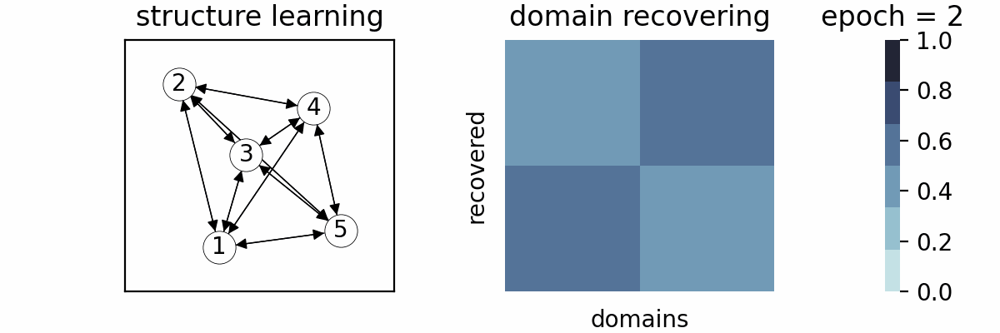

## Chenxi Liu (he/him)

    

        
    

    

        
I am currently a Ph.D student at <a href="https://www.comp.hkbu.edu.hk">HKBU CSD</a>, supervised by <a href="https://bhanml.github.io/">Dr. Bo Han</a>. 
        Before that, I worked closely with Prof. <a href="https://kunkuang.github.io/">Kun Kuang</a> at <a href="http://www.cs.zju.edu.cn/">ZJU CS</a>.
        Previously, I obtained my B.Sc & M.Sc degree in Statistics from <a href="https://stat-ds.sustech.edu.cn/?lang=en-us">SUSTech</a> and <a href="https://math.fudan.edu.cn/mathen/main.htm">Fudan</a> respectively.

        
<b>Research Vision</b>: To develope the artificial general intelligence that can actively reveal and utilize causal mechanism behind the complex reality.

        
Contact: cscxliu (AT) comp (dot) hkbu (dot) edu (dot) hk

        
Office: DLB 625. Hong Kong Baptist University. Kowloon Tong, Hong Kong SAR. 

        
<a href="https://github.com/chxliou">Github</a> / <a href="https://scholar.google.com/citations?user=cIGI2jAAAAAJ">Publications</a> / <a href="https://www.linkedin.com/in/chenxi-liu-b79170147/">LinkedIn</a>

    

## Publications

    

        
    

    

        
<b>Discovery of the Hidden World with Large Language Models</b>   
        Chenxi Liu*, Yongqiang Chen*, Tongliang Liu, Mingming Gong, James Cheng, Bo Han, and Kun Zhang  
        In <i>Advances in Neural Information Processing Systems (<b>NeurIPS</b>), 2024.</i>  
        <a href="https://arxiv.org/abs/2402.03941">[paper]</a>  <a href="https://causalcoat.github.io/">[website]</a>

    

    

        
    

    

        
<b>Causal Structure Learning for Latent Intervened Non-stationary Data</b>   
        Chenxi Liu and Kun Kuang  
        In <i>International Conference on Machine Learning (<b>ICML</b>), 2023.</i>  
        <a href="https://proceedings.mlr.press/v202/liu23t">[paper]</a> <a href="https://github.com/chxliou/LIN2023">[code]</a>

    

